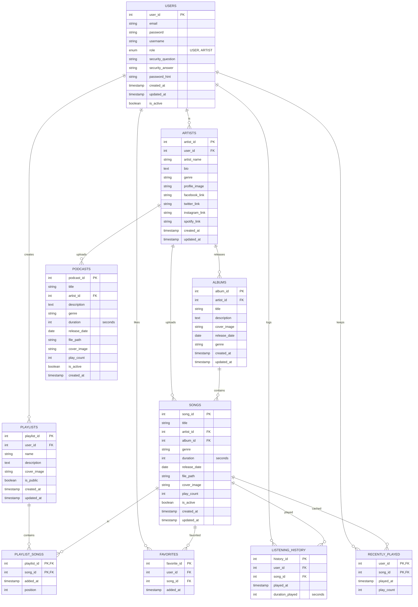

# RevPlay Entity Relationship Diagram (ERD)

```mermaid
erDiagram
    USERS {
        int user_id PK
        string email
        string password
        string username
        enum role "USER, ARTIST"
        string security_question
        string security_answer
        string password_hint
        timestamp created_at
        timestamp updated_at
        boolean is_active
    }

    ARTISTS {
        int artist_id PK
        int user_id FK
        string artist_name
        text bio
        string genre
        string profile_image
        string facebook_link
        string twitter_link
        string instagram_link
        string spotify_link
        timestamp created_at
        timestamp updated_at
    }

    ALBUMS {
        int album_id PK
        int artist_id FK
        string title
        text description
        string cover_image
        date release_date
        string genre
        timestamp created_at
        timestamp updated_at
    }

    SONGS {
        int song_id PK
        string title
        int artist_id FK
        int album_id FK
        string genre
        int duration "seconds"
        date release_date
        string file_path
        string cover_image
        int play_count
        boolean is_active
        timestamp created_at
        timestamp updated_at
    }

    PODCASTS {
        int podcast_id PK
        string title
        int artist_id FK
        text description
        string genre
        int duration "seconds"
        date release_date
        string file_path
        string cover_image
        int play_count
        boolean is_active
        timestamp created_at
    }

    PLAYLISTS {
        int playlist_id PK
        int user_id FK
        string name
        text description
        string cover_image
        boolean is_public
        timestamp created_at
        timestamp updated_at
    }

    PLAYLIST_SONGS {
        int playlist_id PK, FK
        int song_id PK, FK
        timestamp added_at
        int position
    }

    FAVORITES {
        int favorite_id PK
        int user_id FK
        int song_id FK
        timestamp added_at
    }

    LISTENING_HISTORY {
        int history_id PK
        int user_id FK
        int song_id FK
        timestamp played_at
        int duration_played "seconds"
    }

    RECENTLY_PLAYED {
        int user_id PK, FK
        int song_id PK, FK
        timestamp played_at
        int play_count
    }

    USERS ||--o{ ARTISTS : "is"
    USERS ||--o{ PLAYLISTS : "creates"
    USERS ||--o{ FAVORITES : "likes"
    USERS ||--o{ LISTENING_HISTORY : "logs"
    USERS ||--o{ RECENTLY_PLAYED : "keeps"

    ARTISTS ||--o{ ALBUMS : "releases"
    ARTISTS ||--o{ SONGS : "uploads"
    ARTISTS ||--o{ PODCASTS : "uploads"

    ALBUMS ||--o{ SONGS : "contains"

    PLAYLISTS ||--o{ PLAYLIST_SONGS : "contains"
    SONGS ||--o{ PLAYLIST_SONGS : "in"
    
    SONGS ||--o{ FAVORITES : "favorited"
    SONGS ||--o{ LISTENING_HISTORY : "played"
    SONGS ||--o{ RECENTLY_PLAYED : "cached"
```
