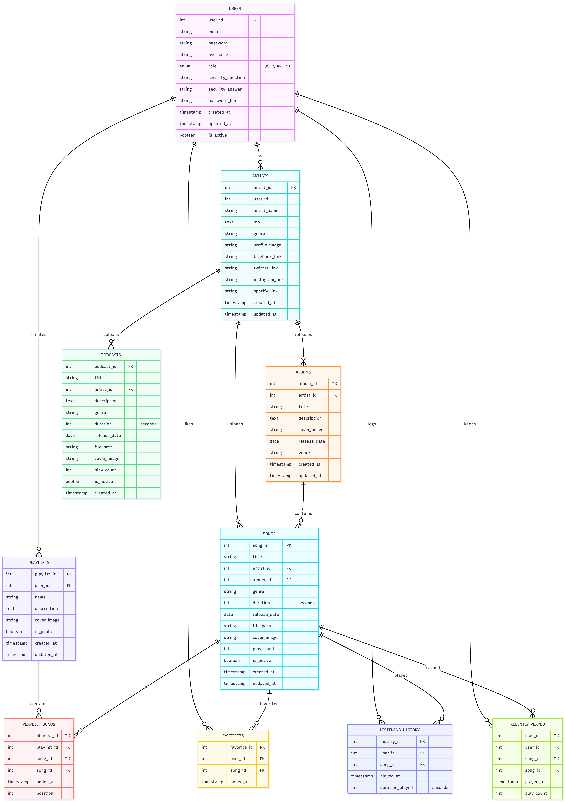

# RevPlay - Music Streaming Application (Console Basis)

RevPlay is a robust core implementation of a music streaming service, built with Java. It provides a featured console interface for users to register, login, search for music, manage playlists, follow artists, and track listening history.

## 🚀 Features

*   **User Management**: Registration, Login, Profile Management, Password Recovery
*   **Role-Based Access**: Distinguishes between standard Listeners and Artists.
*   **Artist Features**: Artists can upload songs, create albums, and view stats.
*   **Music Library**:
    *   Search by Song, Artist, Album, or Genre.
    *   Smart search (partial match).
    *   Browse by categories.
*   **Playlists**: Create public/private playlists, add/remove songs.
*   **Playback Simulation**: "Play" songs, auto-queue management (history, shuffle, repeat).
*   **Listening History**: Tracks user activity, recently played songs, and top genres.
*   **Favorites**: Like songs and follow artists.
*   **Logging**: Comprehensive logging of user actions and errors (located in `backend/logs`).

## 🛠️ Technology Stack

*   **Language**: Java 21
*   **Build Tool**: Maven
*   **Database**: MySQL 8.0
*   **Logging**: Log4j 2
*   **Testing**: JUnit 5, Mockito
*   **Environment**: Dotenv (for secure configuration)

## 📊 Database Schema

The following Entity Relationship Diagram (ERD) illustrates the core data structure of RevPlay, including Users, Artists, Albums, Songs, and engagement features.




## 📂 Project Structure

```text
RevPlay/
├── backend/
│   ├── src/
│   │   ├── main/
│   │   │   ├── java/com/revplay/
│   │   │   │   ├── app/        # Main Application Class
│   │   │   │   ├── config/     # Database Connection Factory
│   │   │   │   ├── dao/        # Data Access Objects (SQL operations)
│   │   │   │   ├── model/      # Entity Classes (POJOs)
│   │   │   │   ├── service/    # Business Logic Service Layer
│   │   │   │   ├── ui/         # Console User Interface & Menus
│   │   │   │   └── util/       # Utility Classes (Security, Input)
│   │   │   └── resources/
│   │   │       └── log4j2.xml    # Logging Configuration
│   │   └── test/java/com/revplay/
│   │       ├── service/        # Service Layer Unit Tests
│   │       └── util/           # Utility Tests
│   ├── logs/                   # Application & Error Logs
│   └── pom.xml                 # Maven Dependencies
├── database/
│   ├── schema.sql              # Database Creation Script
│   └── seed_data.sql           # Initial Test Data
├── architecture.md             # System Architecture Docs
├── ERD.md                      # Entity Relationship Diagram Source
└── README.md                   # Project Documentation
```


## ⚙️ Setup & Installation

### 1. Prerequisites
*   **JDK 21** or higher
*   **MySQL Server**
*   **Maven**

### 2. Database Setup
1.  Navigate to the `database` folder.
2.  Run the schema script:
    ```sql
    source schema.sql;
    ```
3.  (Optional) Run seed data:
    ```sql
    source seed_data.sql;
    ```

### 3. Configuration
1.  Create a `.env` file in the `backend/` directory.
2.  Add your MySQL credentials:
    ```env
    DB_URL=jdbc:mysql://localhost:3306/revplay_db
    DB_USER=your_username
    DB_PASSWORD=your_password
    ```

## ▶️ Running the Application

### Via Maven
```bash
cd backend
mvn clean compile exec:java
```

### Via JAR
```bash
mvn clean package
java -jar target/revplay.jar
```
*(Ensure the main class is configured in pom.xml)*

## 🧪 Testing

Run all unit tests with:
```bash
cd backend
mvn test
```

## 📝 Logging & Security
*   **Logs**: stored in `backend/logs/`
*   **Security**: SHA-256 for passwords, input validation enabled.

---
**RevPlay**
